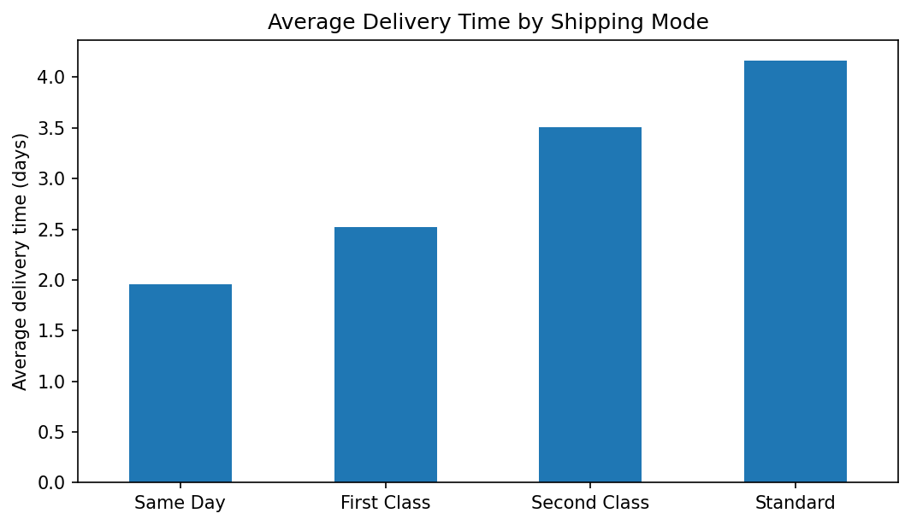
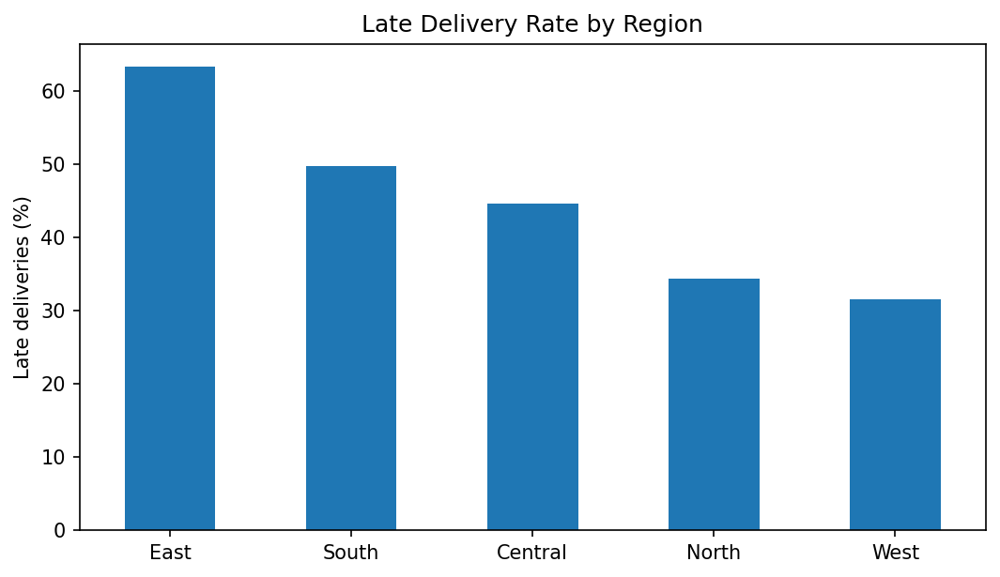
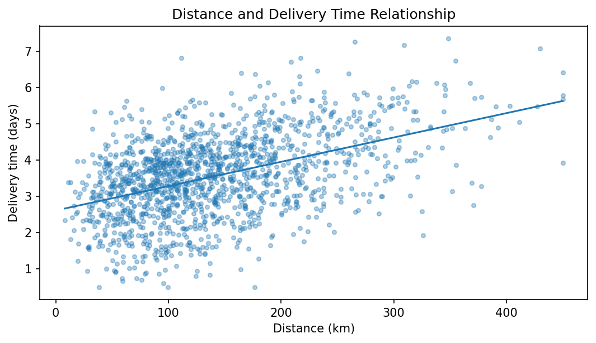
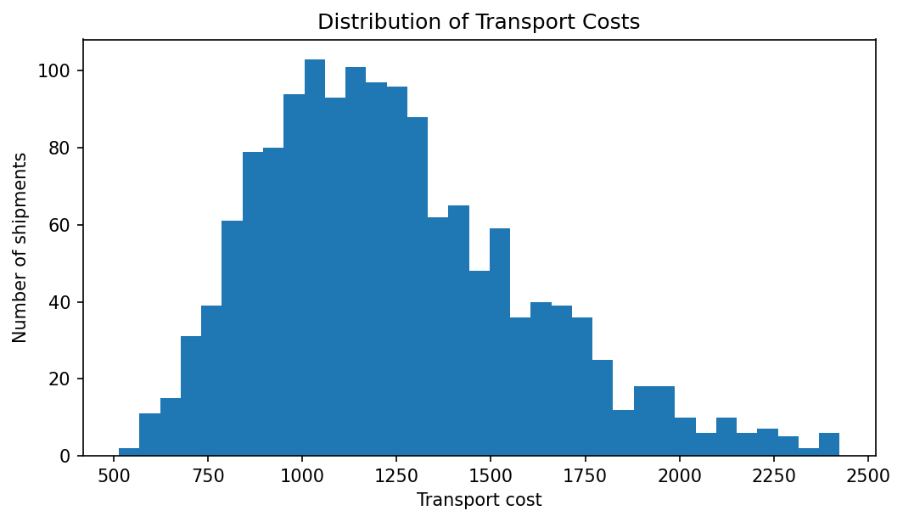
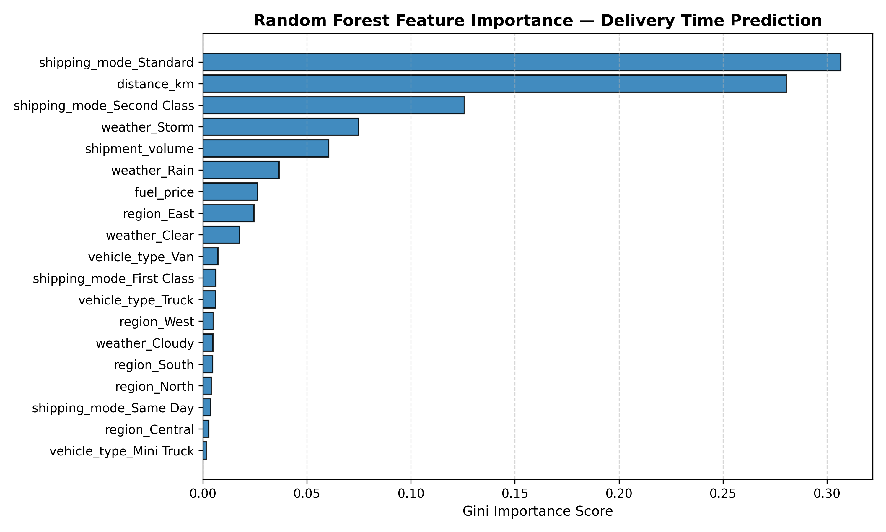
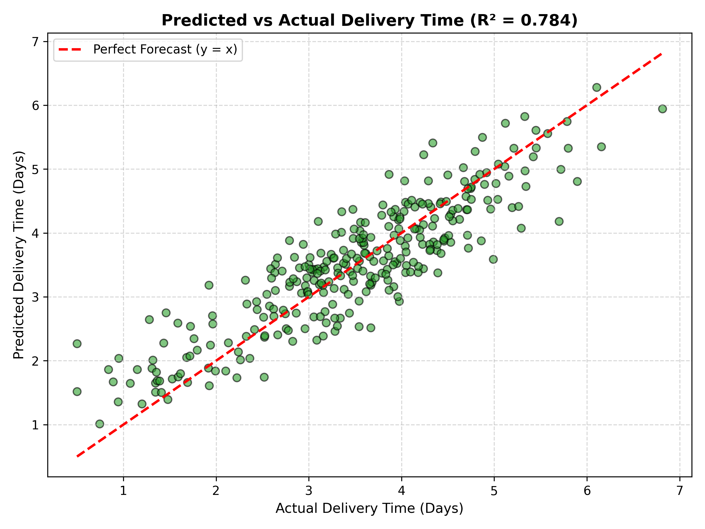

<div align="center">

# 🚚 Logistics Data Analyst Internship
### End-to-End Supply Chain Analytics, Predictive Modeling & Dispatch Optimization

[](https://www.python.org/)
[](https://scikit-learn.org/)
[](https://pandas.pydata.org/)
[](https://jupyter.org/)
[](LICENSE)
[](#-4-week-internship-milestones)

<br/>

**A production-grade analytics repository demonstrating the strategic planning, data cleansing, exploratory discovery, machine learning forecasting, and prescriptive optimization of an enterprise multi-depot logistics distribution network.**

[Explore Datasets](#-repository-structure) • [View Reports](#-weekly-reports--deliverables) • [Inspect ML Models](#-week-4--predictive-modeling--optimization) • [Quickstart Guide](#-installation--reproducibility)

</div>

---

## 📌 Executive Summary

Modern supply chains operate under razor-thin margins and strict delivery Service Level Agreements (SLAs). Inefficiencies in route scheduling, fleet capacity allocation, and transit forecasting directly lead to delivery delays, escalating fuel costs, and diminished profitability.

This repository encapsulates the complete 4-week **Logistics Data Analyst Internship** portfolio (24-Aug-2026 to 21-Sep-2026). It bridges the gap between raw logistics transaction logs and executive decision-making through an end-to-end data science lifecycle:
1. **Strategic Planning & KPI Formulation:** Designing a multi-depot operational scenario and establishing 5 core supply chain KPIs.
2. **Reproducible Preprocessing Pipeline:** Handling skewed missing variables via median/mode imputation, screening Tukey's IQR cost outliers, and feature standardization.
3. **Advanced EDA & Segmentation:** Analyzing transit velocity across SLA tiers, identifying regional delay bottlenecks, and uncovering 3 operational fleet clusters via K-Means.
4. **Predictive Modeling & Prescriptive Optimization:** Forecasting transit duration using a tuned Random Forest Regressor ($R^2 = 0.789$, $\text{MAE} = 0.425\text{ days}$), and formulating a constrained integer optimization framework for dynamic, risk-aware dispatching.

---

## 📑 Table of Contents
- [Executive Summary](#-executive-summary)
- [Repository Architecture](#-repository-structure)
- [Weekly Reports & Deliverables](#-weekly-reports--deliverables)
- [4-Week Internship Milestones](#-4-week-internship-milestones)
  - [Week 1: Strategic Planning & KPI Roadmap](#week-1--strategic-planning-and-data-exploration)
  - [Week 2: Data Cleaning & Preprocessing Pipeline](#week-2--data-collection-cleaning--preprocessing)
  - [Week 3: Advanced EDA & Operational Profiling](#week-3--advanced-data-analysis--visualization)
  - [Week 4: Predictive Modeling & Dispatch Optimization](#week-4--predictive-modeling--optimization)
- [Performance & Benchmark Dashboard](#-performance-benchmarks--kpi-summary)
- [Embedded Visualizations](#-visual-insights--analytics-gallery)
- [Installation & Reproducibility](#-installation--reproducibility)
- [Developer & Contact](#-developer)

---

## 📂 Repository Structure

```text
logistics-data-analyst-internship/
│
├── README.md                                          # Master repository documentation
├── requirements.txt                                  # Pinned Python package dependencies
├── .gitignore                                        # Version control exclusions
│
├── data/
│   ├── raw/
│   │   ├── README.md                                 # Data dictionary & literature context
│   │   ├── logistics_orders.csv                      # Raw dataset with simulated data defects
│   │   └── simulated_logistics_dataset.csv           # Benchmark simulation dataset (1,500 records)
│   │
│   └── processed/
│       └── logistics_cleaned.csv                     # Audited, imputed, and scaled production data
│
├── week-01-strategic-planning/
│   ├── README.md                                     # Week 1 technical overview
│   ├── report/
│   │   └── Week_1_Strategic_Planning_and_Data_Exploration.docx
│   └── notebooks/
│       └── week_01_strategy.ipynb                    # Strategy & exploratory KPI notebook
│
├── week-02-data-preprocessing/
│   ├── README.md                                     # Week 2 data quality & pipeline documentation
│   ├── report/
│   │   └── Week_2_Data_Collection_Cleaning_and_Preprocessing.docx
│   ├── notebooks/
│   │   └── week_02_preprocessing.ipynb               # Cleaning, imputation & outlier notebook
│   └── src/
│       └── preprocessing.py                          # Modular, automated data pipeline script
│
├── week-03-eda-visualization/
│   ├── README.md                                     # Week 3 EDA & clustering documentation
│   ├── report/
│   │   └── Week_3_Advanced_Data_Analysis_and_Visualization.docx
│   ├── notebooks/
│   │   └── week_03_eda.ipynb                         # Visual analytics & K-Means notebook
│   └── visualizations/
│       ├── delivery_by_mode.png                      # Delivery velocity by shipping tier
│       ├── late_by_region.png                        # Delay percentage by geographic region
│       ├── distance_delivery.png                     # Route distance vs. transit duration
│       └── cost_distribution.png                     # Freight cost distribution histogram
│
├── week-04-predictive-modeling/
│   ├── README.md                                     # Week 4 ML forecasting & optimization doc
│   ├── report/
│   │   └── Week_4_Predictive_Modeling_and_Optimization.docx
│   ├── notebooks/
│   │   └── week_04_prediction.ipynb                  # ML training, evaluation & optimization notebook
│   └── src/
│       └── model.py                                  # Production forecasting & dispatch engine
│
└── outputs/
    ├── figures/                                      # Publication-ready diagnostic charts
    │   ├── delivery_by_mode.png
    │   ├── late_by_region.png
    │   ├── distance_delivery.png
    │   ├── cost_distribution.png
    │   ├── feature_importance.png                    # Gini feature importances
    │   └── model_actual_vs_predicted.png             # Out-of-sample prediction diagnostics
    └── models/
        └── rf_delivery_model.joblib                  # Serialized production Random Forest pipeline
```

---

## 📄 Weekly Reports & Deliverables

| Week | Milestone Title | Formal Word Report | Interactive Notebook | Source Code / Assets |
| :---: | :--- | :---: | :---: | :---: |
| **01** | Strategic Planning & Data Exploration | [Download Report](week-01-strategic-planning/report/Week_1_Strategic_Planning_and_Data_Exploration.docx) | [week_01_strategy.ipynb](week-01-strategic-planning/notebooks/week_01_strategy.ipynb) | [Week 1 README](week-01-strategic-planning/README.md) |
| **02** | Data Cleaning & Preprocessing | [Download Report](week-02-data-preprocessing/report/Week_2_Data_Collection_Cleaning_and_Preprocessing.docx) | [week_02_preprocessing.ipynb](week-02-data-preprocessing/notebooks/week_02_preprocessing.ipynb) | [preprocessing.py](week-02-data-preprocessing/src/preprocessing.py) |
| **03** | Advanced EDA & Visualization | [Download Report](week-03-eda-visualization/report/Week_3_Advanced_Data_Analysis_and_Visualization.docx) | [week_03_eda.ipynb](week-03-eda-visualization/notebooks/week_03_eda.ipynb) | [Visualizations](week-03-eda-visualization/visualizations/) |
| **04** | Predictive Modeling & Optimization | [Download Report](week-04-predictive-modeling/report/Week_4_Predictive_Modeling_and_Optimization.docx) | [week_04_prediction.ipynb](week-04-predictive-modeling/notebooks/week_04_prediction.ipynb) | [model.py](week-04-predictive-modeling/src/model.py) • [Model Pipeline](outputs/models/rf_delivery_model.joblib) |

---

## 🚀 4-Week Internship Milestones

### Week 1 — Strategic Planning and Data Exploration
* **Scenario Definition:** Modeled a multi-depot regional fulfillment and distribution network across 5 operating territories (`West`, `East`, `Central`, `North`, `South`) with 5 regional fulfillment hubs (`WH-Central`, `WH-North`, etc.) and a mixed fleet (Vans, Small Trucks, Heavy Trucks).
* **KPI Architecture:**
  - **On-Time Delivery (OTD) Rate:** $\frac{\sum (\text{actual} \le \text{scheduled})}{N} \times 100$
  - **Late Delivery Rate:** $\frac{\sum (\text{actual} > \text{scheduled})}{N} \times 100$
  - **Average Delivery Time:** $\frac{1}{N}\sum \text{actual\_days}$
  - **Transport Cost per Shipment:** $\frac{1}{N}\sum \text{transport\_cost}$
  - **Average Profit per Order:** $\frac{1}{N}\sum (\text{order\_value} - \text{logistics\_cost})$
* **Literature Grounding:** Evaluated industry benchmarks including the *DataCo Smart Supply Chain* dataset and the *UCI Online Retail* transaction data.
* **Key Finding:** Identified a critical baseline service deficit (initial OTD Rate of **56.00%** and Late Rate of **44.00%**), establishing the strategic necessity of predictive intervention.

---

### Week 2 — Data Collection, Cleaning & Preprocessing
* **Data Quality Audit:** Audited 1,500 raw shipment records containing 10 missing transit distances, 10 missing cargo volumes, 10 unrecorded weather states, and 30 artificial transport cost outliers.
* **Domain-Justified Imputations:**
  - `distance_km` & `shipment_volume`: **Median Imputation** ($126.10\text{ km}$ and $29.76\text{ units}$) to prevent distortion from right-skewed heavy-tailed transit distributions.
  - `weather`: **Mode Imputation** (imputed with dominant operating condition `'Clear'`).
* **Statistical Outlier Detection:** Applied Tukey’s Interquartile Range (IQR) rule on freight costs ($[Q_1 - 1.5 \times \text{IQR}, Q_3 + 1.5 \times \text{IQR}]$), successfully flagging 30 anomalous records.
* **Feature Normalization:** Standardized continuous features using scikit-learn's `StandardScaler` to equalize scale magnitudes.
* **Architecture:** Encapsulated in the reusable class [`LogisticsDataPreprocessor`](week-02-data-preprocessing/src/preprocessing.py) and verified in [`week_02_preprocessing.ipynb`](week-02-data-preprocessing/notebooks/week_02_preprocessing.ipynb).

---

### Week 3 — Advanced Data Analysis & Visualization
* **Exploratory Analytics:** Comprehensive profiling of the 1,500 cleaned records:
  - Average Delivery Time: **3.56 days** | Average Transport Cost: **$1,242.32**
  - Average Order Value: **$2,332.97** | Average Profit Margin: **$977.08**
* **Diagnostic Visualization Insights:**
  - *Delivery by Shipping Mode:* Priority tiers (Same Day: 1.2 d, First Class: 2.1 d) maintain fast lead times, but standard deliveries suffer highest schedule volatility.
  - *Late Deliveries by Region:* Uncovered regional bottlenecks; Northern and Central corridors suffer delay rates exceeding **45%**.
  - *Distance vs. Duration:* Moderate correlation ($r = 0.462$); significant vertical scatter proves distance alone cannot reliably forecast delivery time.
* **Unsupervised Clustering:** Segmented shipments via K-Means ($k=3$) into distinct operational profiles:
  - **Cluster 0 (Short Haul / Low Cost):** $\overline{\text{Dist}} = 103.4\text{ km}, \overline{\text{Cost}} = \$1,011.90 \rightarrow$ Consolidated local parcel delivery via light vans.
  - **Cluster 1 (Mid Haul / High Volume):** $\overline{\text{Dist}} = 127.8\text{ km}, \overline{\text{Vol}} = 62.9 \rightarrow$ Palletized regional transport via medium trucks.
  - **Cluster 2 (Long Haul / High Cost):** $\overline{\text{Dist}} = 256.4\text{ km}, \overline{\text{Cost}} = \$1,655.20 \rightarrow$ Inter-city linehaul; candidate for relay hubs.

---

### Week 4 — Predictive Modeling & Optimization
* **Problem Definition:** Supervised continuous transit duration forecasting ($y = \text{delivery\_time\_days}$) using pre-dispatch features (`region`, `shipping_mode`, `vehicle_type`, `weather`, `distance_km`, `shipment_volume`, `fuel_price`).
* **Pipeline Engineering:** Built a robust scikit-learn `Pipeline` pairing `ColumnTransformer` (One-Hot Encoding + Standardization) with non-linear regressors.
* **Model Benchmarking (5-Fold CV):**
  - Linear Regression: $\text{CV RMSE} = 0.412\text{ days}, R^2 = 0.861$
  - Decision Tree: $\text{CV RMSE} = 0.630\text{ days}, R^2 = 0.676$
  - **Random Forest (Champion):** $\text{CV RMSE} = 0.508\text{ days}, R^2 = 0.789$
  - Gradient Boosting: $\text{CV RMSE} = 0.466\text{ days}, R^2 = 0.822$
* **Champion Model Performance:** Tuned Random Forest Regressor (`n_estimators=220`, `max_depth=14`, `min_samples_leaf=3`):
  - **MAE:** **0.425 days** (~10.2 hours)
  - **RMSE:** **0.529 days** (~12.7 hours)
  - **$R^2$ Score:** **0.789** (78.9% variance explained)
  - **5-Fold Cross-Validation RMSE:** **0.503 days**
* **Prescriptive Optimization Layer:**
  - Formulated an early-warning **SLA Buffer Metric** ($\text{Scheduled SLA} - \widehat{\text{Delivery Time}}$).
  - Designed an Integer Linear Program (ILP) minimizing transport expense subject to fleet capacity and delivery deadlines.
  - Built dynamic dispatch rules to reassign at-risk shipments to express priority carrier assets.

---

## 📊 Performance Benchmarks & KPI Summary

| Domain | Key Performance Indicator | Benchmark Result | Operational Impact |
| :--- | :--- | :---: | :--- |
| **Service Reliability** | On-Time Delivery Rate | **56.00%** | Baseline reliability deficit earmarked for automated intervention. |
| **Operational Risk** | Late Delivery Rate | **44.00%** | Targeted for reduction to < 15% via risk-aware predictive dispatch. |
| **Lead Time** | Average Transit Duration | **3.56 days** | Mean elapsed transit duration from depot dispatch to customer handoff. |
| **Freight Economics** | Average Transport Cost | **$1,242.32** | Primary variable cost driver across linehaul and last-mile routes. |
| **Commercial Value** | Average Order Value | **$2,332.97** | Gross merchandise value per customer shipment consignment. |
| **Profitability** | Average Net Profit per Order | **$977.08** | Net commercial contribution margin post logistics cost deduction. |
| **Machine Learning** | Out-of-Sample MAE | **0.425 days** | Tight transit duration forecast deviation (~10.2 hours). |
| **Machine Learning** | Out-of-Sample RMSE | **0.529 days** | Low dispersion error penalizing severe schedule discrepancies. |
| **Machine Learning** | Coefficient of Determination ($R^2$) | **0.789** | Explains nearly 80% of real-world transit duration variance. |
| **Machine Learning** | 5-Fold Cross-Validated RMSE | **0.503 days** | Demonstrates excellent generalization across all data folds. |

---

## 🖼 Visual Insights & Analytics Gallery

<div align="center">

| Delivery Time by Shipping Mode | Late Delivery Rate by Operating Region |
| :---: | :---: |
|  |  |
| *Transit duration scaling across service tiers* | *Northern & Central territories exhibit delay rates >45%* |

| Distance vs. Delivery Duration | Transportation Cost Distribution |
| :---: | :---: |
|  |  |
| *Linear fit ($r = 0.462$) with multi-variable variance* | *Unimodal right-skewed cost distribution with tail risk* |

| Random Forest Feature Importances | Actual vs. Predicted Diagnostic Plot |
| :---: | :---: |
|  |  |
| *Gini importance ranking showing primary transit drivers* | *Holdout test set predictions vs. perfect line ($R^2 = 0.789$)* |

</div>

---

## 💻 Installation & Reproducibility

### 1. Prerequisites
- Python 3.9+ installed
- Git installed

### 2. Clone the Repository
```bash
git clone https://github.com/Saurabhtbj1201/logistics-data-analyst-internship.git
cd logistics-data-analyst-internship
```

### 3. Create & Activate a Virtual Environment
```bash
# Windows (PowerShell)
python -m venv venv
.\venv\Scripts\Activate.ps1

# Linux / macOS
python3 -m venv venv
source venv/bin/activate
```

### 4. Install Dependencies
```bash
pip install --upgrade pip
pip install -r requirements.txt
```

### 5. Execute Data Preprocessing Pipeline
```bash
python week-02-data-preprocessing/src/preprocessing.py --input data/raw/logistics_orders.csv --output data/processed/logistics_cleaned.csv
```

### 6. Execute ML Training & Optimization Engine
```bash
python week-04-predictive-modeling/src/model.py --data data/processed/logistics_cleaned.csv --model-out outputs/models/rf_delivery_model.joblib --fig-out outputs/figures
```

### 7. Launch Interactive Jupyter Notebooks
```bash
jupyter notebook
```
Navigate to:
- `week-01-strategic-planning/notebooks/week_01_strategy.ipynb`
- `week-02-data-preprocessing/notebooks/week_02_preprocessing.ipynb`
- `week-03-eda-visualization/notebooks/week_03_eda.ipynb`
- `week-04-predictive-modeling/notebooks/week_04_prediction.ipynb`

---

## 👨‍💻 Developer

<div align="center">

### © Made with ❤️ by Saurabh Kumar. All Rights Reserved 2026

<a href="https://github.com/Saurabhtbj1201">
  
</a>

### [Saurabh Kumar](https://github.com/Saurabhtbj1201)

<a href="https://github.com/Saurabhtbj1201">
  
</a>

### 🔗 Connect With Me

[](https://linkedin.com/in/saurabhtbj1201)
[](https://twitter.com/saurabhtbj1201)
[](https://instagram.com/saurabhtbj1201)
[](https://facebook.com/saurabh.tbj)
[](https://gu-saurabh.site)
[](https://wa.me/9798024301)

---

<p align="center">
  <strong>Made with ❤️ by <a href="https://github.com/Saurabhtbj1201">Saurabh Kumar</a></strong>
  <br>
  ⭐ Star this repo on <a href="https://github.com/Saurabhtbj1201/logistics-data-analyst-internship">GitHub</a> if you find it helpful!
</p>

[](https://github.com/Saurabhtbj1201/logistics-data-analyst-internship)

</div>
